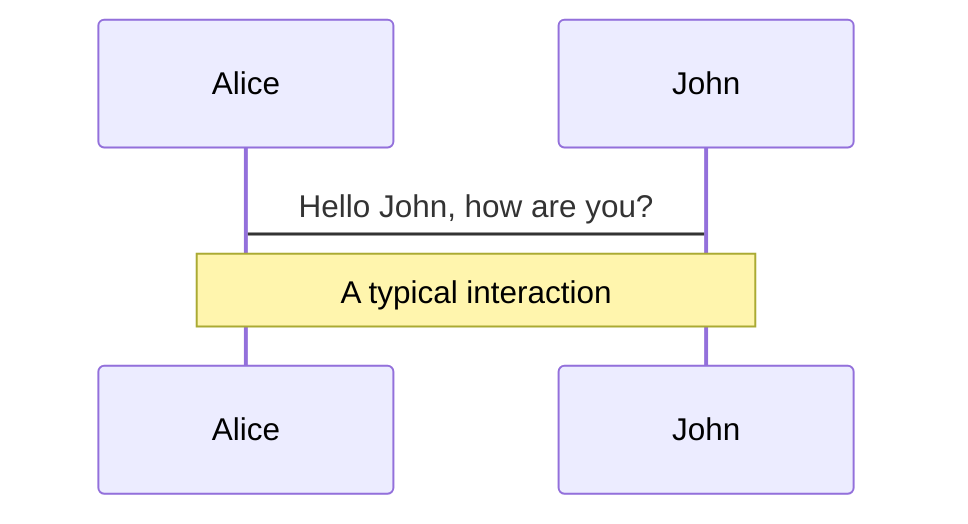
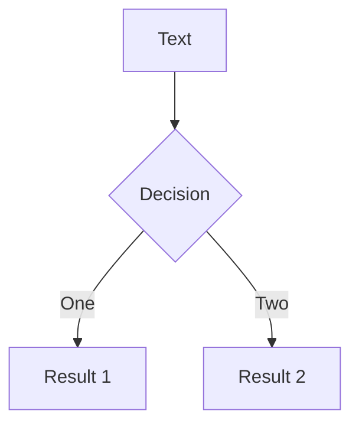

# Slidev Advanced Features Reference

> Research Date: 2026-01-14
> Sources: Official Slidev documentation (sli.dev), GitHub repositories

## Overview

Slidev provides powerful features for technical presentations including LaTeX/KaTeX math, Mermaid diagrams, Monaco code editor, drawing/annotations, and sophisticated animations.

---

## LaTeX / KaTeX Support

Slidev uses [KaTeX](https://katex.org/) for fast, high-quality math rendering.

### Inline Math

```markdown
The quadratic formula is $x = \frac{-b \pm \sqrt{b^2-4ac}}{2a}$
```

### Block Math

```markdown
$$
\begin{aligned}
\nabla \cdot \vec{E} &= \frac{\rho}{\varepsilon_0} \\
\nabla \cdot \vec{B} &= 0 \\
\nabla \times \vec{E} &= -\frac{\partial\vec{B}}{\partial t}
\end{aligned}
$$
```

### Line Highlighting in Math

```markdown
$$ {1|3|all}
\begin{aligned}
\nabla \cdot \vec{E} &= \frac{\rho}{\varepsilon_0} \\
\nabla \cdot \vec{B} &= 0 \\
\nabla \times \vec{E} &= -\frac{\partial\vec{B}}{\partial t}
\end{aligned}
$$
```
Highlights line 1, then 3, then all on successive clicks.

### Chemical Equations (mhchem)

Enable mhchem extension in `vite.config.ts`:

```typescript
import 'katex/contrib/mhchem'

export default {}
```

Then use:
```markdown
$$
\ce{B(OH)3 + H2O <--> B(OH)4^- + H+}
$$
```

### KaTeX Configuration

Create `setup/katex.ts` for advanced options:
```typescript
import { defineKatexSetup } from '@slidev/types'

export default defineKatexSetup(() => {
  return {
    strict: false,
    throwOnError: false,
    macros: {
      '\\RR': '\\mathbb{R}'
    }
  }
})
```

Source: https://sli.dev/features/latex

---

## Mermaid Diagrams

Create diagrams from text using [Mermaid](https://mermaid.js.org/).

### Basic Usage

````markdown

````

### With Options

````markdown

````

Options are JavaScript object literal syntax (quotes for strings, commas between keys).

### Supported Diagram Types

- `flowchart` / `graph` - Flow diagrams
- `sequenceDiagram` - Sequence diagrams
- `classDiagram` - Class diagrams
- `stateDiagram-v2` - State diagrams
- `erDiagram` - Entity-relationship
- `gantt` - Gantt charts
- `pie` - Pie charts
- `journey` - User journey

### Mermaid Configuration

Create `setup/mermaid.ts`:
```typescript
import { defineMermaidSetup } from '@slidev/types'

export default defineMermaidSetup(() => {
  return {
    theme: 'neutral',
    themeVariables: {
      primaryColor: '#5d8392'
    }
  }
})
```

Source: https://sli.dev/features/mermaid

---

## Monaco Editor

Slidev embeds VS Code's Monaco editor for interactive code blocks.

### Basic Usage

````markdown
```ts {monaco}
import { ref } from 'vue'
const count = ref(0)
console.log(count.value)
```
````

### Monaco with Execution

````markdown
```ts {monaco-run}
console.log('This will execute!')
```
````

### Editor Options

````markdown
```ts {monaco} { editorOptions: { wordWrap: 'on' } }
const longText = 'This is a very long line that should wrap'
```
````

### TypeScript Type Acquisition

Types auto-import from installed packages. Force additional types:
```yaml
---
monacoTypesAdditionalPackages:
  - lodash-es
  - my-types-package
---
```

Or use CDN types:
```yaml
---
monacoTypesSource: ata  # Auto Type Acquisition from CDN
---
```

### Monaco Configuration

Create `setup/monaco.ts`:
```typescript
import { defineMonacoSetup } from '@slidev/types'

export default defineMonacoSetup(async (monaco) => {
  // Register custom languages, themes, etc.
  return {
    editorOptions: {
      wordWrap: 'on',
      minimap: { enabled: false }
    }
  }
})
```

### Theme Integration

Since v0.48.0, Monaco uses your configured Shiki theme automatically via `@shikijs/monaco`.

### Disabling Monaco

```yaml
---
monaco: false  # or 'dev' or 'build'
---
```

Source: https://sli.dev/custom/config-monaco

---

## Drawing & Annotations

Built-in drawing powered by [drauu](https://github.com/antfu/drauu).

### Enable/Disable

```yaml
---
drawings:
  enabled: true       # Enable drawing (default)
  persist: false      # Save drawings to .slidev/drawings/
  presenterOnly: false # Only presenter can draw
  syncAll: true       # Sync drawings across instances
---
```

### Configuration Options

| Option | Values | Description |
|--------|--------|-------------|
| `enabled` | `true`/`false`/`dev` | Control availability |
| `persist` | `true`/`false` | Save as SVG files |
| `presenterOnly` | `true`/`false` | Restrict to presenter |
| `syncAll` | `true`/`false` | Real-time sync |

### Stylus Pen Support

Slidev auto-detects stylus input (Apple Pencil, etc.) and enables drawing without toggling the mode manually.

### Persisted Drawings

With `persist: true`, drawings save to `.slidev/drawings/` as SVG files and export with your PDF.

Source: https://sli.dev/features/drawing

---

## Animations

### Click Animations

```markdown
<v-click> Appears on first click </v-click>
<div v-click> Appears on second click </div>
<v-click>

- Item 1
- Item 2

</v-click>
```

### v-clicks (Bulk Animation)

```markdown
<v-clicks>

- Item 1  <!-- click 1 -->
- Item 2  <!-- click 2 -->
- Item 3  <!-- click 3 -->

</v-clicks>
```

With nested lists:
```markdown
<v-clicks depth="2">

- Item 1
  - Item 1.1  <!-- animated separately -->
  - Item 1.2
- Item 2

</v-clicks>
```

### Positioning (at)

```markdown
<div v-click="3"> Appears at click 3 (absolute) </div>
<div v-click="'+2'"> Appears 2 clicks after previous (relative) </div>
```

### Hide After Click

```markdown
<div v-click.hide> Hidden after click </div>
<div v-click="[2, 4]"> Visible only at clicks 2-3 </div>
```

### v-switch Component

```markdown
<v-switch>
  <template #1> Shown at click 1 </template>
  <template #2> Shown at click 2 </template>
  <template #5-7> Shown at clicks 5-6 </template>
</v-switch>
```

### Custom Click Count

```yaml
---
clicks: 10  # Force 10 clicks before next slide
---
```

### Element Transitions

Default CSS classes:
```css
.slidev-vclick-target {
  transition: opacity 100ms ease;
}
.slidev-vclick-hidden {
  opacity: 0;
  pointer-events: none;
}
```

Custom transitions:
```css
.slidev-vclick-target {
  transition: all 500ms ease;
}
.slidev-vclick-hidden {
  transform: scale(0);
}
```

Source: https://sli.dev/guide/animations

---

## Motion (VueUse)

Built-in `@vueuse/motion` for advanced animations.

### Basic Motion

```html
<div
  v-motion
  :initial="{ x: -80 }"
  :enter="{ x: 0 }"
  :leave="{ x: 80 }"
>
  Animated content
</div>
```

### Motion with Clicks

```html
<div
  v-motion
  :initial="{ x: -80 }"
  :enter="{ x: 0, y: 0 }"
  :click-1="{ x: 0, y: 30 }"
  :click-2="{ y: 60 }"
  :click-2-4="{ x: 40 }"
  :leave="{ y: 0, x: 80 }"
>
  Click-triggered motion
</div>
```

### Variant Priority

1. `initial` - Before entering slide
2. `enter` - On slide entry (lowest priority)
3. `click-x` - At absolute click X
4. `click-x-y` - Between clicks X and Y
5. `leave` - Leaving slide

Source: https://motion.vueuse.org/

---

## Slide Transitions

### Built-in Transitions

```yaml
---
transition: slide-left  # or: fade, fade-out, slide-right, slide-up, slide-down, view-transition
---
```

### Per-Direction Transitions

```yaml
---
transition: slide-left | slide-right  # forward | backward
---
```

### View Transitions API

```yaml
---
transition: view-transition
mdc: true
---

# Title {.view-transition-title}

---

# Title {.view-transition-title}
```

Elements with same `view-transition-name` animate between slides.

### Custom Transitions

```css
.my-transition-enter-active,
.my-transition-leave-active {
  transition: opacity 0.5s ease;
}
.my-transition-enter-from,
.my-transition-leave-to {
  opacity: 0;
}
```

Source: https://sli.dev/guide/animations#slide-transitions

---

## Global Layers

Persistent components across slides.

### Layer Types

| File | Description |
|------|-------------|
| `global-top.vue` | Above all slides (single instance) |
| `global-bottom.vue` | Below all slides (single instance) |
| `slide-top.vue` | Per-slide top layer |
| `slide-bottom.vue` | Per-slide bottom layer |
| `custom-nav-controls.vue` | Custom navigation buttons |

### Example: Footer

```vue
<!-- global-bottom.vue -->
<template>
  <footer v-if="$nav.currentLayout !== 'cover'" class="absolute bottom-0 left-0 right-0 p-2">
    {{ $nav.currentPage }} / {{ $nav.total }}
  </footer>
</template>
```

### Export Tip

When using global layers with navigation state, use `--per-slide` export option:
```bash
slidev export --per-slide
```

Source: https://sli.dev/features/global-layers

---

## Gotchas and Edge Cases

### ⚠️ LaTeX in Markdown Tables

Escape pipes in LaTeX: `\|` instead of `|`

### ⚠️ Mermaid Theme Conflicts

Mermaid themes may not match your Slidev theme. Use `setup/mermaid.ts` to customize.

### ⚠️ Monaco in PDF Export

Monaco editors render as static images in PDF. Use `--with-clicks` for step captures.

### ⚠️ Motion + v-click Bug

Due to Vue bug, only `v-click` on the same element as `v-motion` controls animation. Workaround:
```html
<div v-if="$clicks >= 3" v-motion ...>
```

### ⚠️ Drawing Sync in Static Build

Drawings don't sync in static builds without the `slidev-addon-sync` addon.

---

## Resources

- LaTeX/KaTeX: https://sli.dev/features/latex
- Mermaid: https://sli.dev/features/mermaid
- Monaco: https://sli.dev/custom/config-monaco
- Drawing: https://sli.dev/features/drawing
- Animations: https://sli.dev/guide/animations
- Global Layers: https://sli.dev/features/global-layers
- VueUse Motion: https://motion.vueuse.org/
