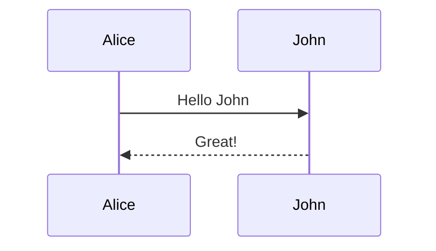

# Slidev Features and Best Practices

**Purpose:** Comprehensive reference for building Slidev-style HTML presentations with modern features, code highlighting, and interactive elements.

**Sources:**
- [Slidev Official Documentation](https://sli.dev/)
- [Slidev Features](https://sli.dev/features/)
- [Slidev Line Highlighting](https://sli.dev/features/line-highlighting)
- [Slidev Mermaid Support](https://sli.dev/features/mermaid)
- [Slidev Building and Hosting](https://sli.dev/guide/hosting)

---

## Core Architecture

### Markdown-First Approach

Slidev uses Markdown as the primary authoring format with YAML frontmatter for configuration:

```markdown
---
theme: default
background: https://source.unsplash.com/collection/94734566/1920x1080
class: 'text-center'
highlighter: shiki
lineNumbers: false
---

# Slide Title

Content here

---

# Second Slide

More content
```

### Slide Separators

- `---` - Horizontal separator (new slide)
- `---layout: name---` - Slide with specific layout
- No vertical nesting (unlike reveal.js)

---

## Built-in Layouts

Slidev provides 10+ built-in layouts:

### 1. **default**
Basic layout for any content

### 2. **center**
Centers content vertically and horizontally

### 3. **cover**
Title slide with large heading, optional subtitle and background

```markdown
---
layout: cover
---

# Presentation Title
Subtitle or description
```

### 4. **intro**
Similar to cover but optimized for speaker introduction

### 5. **section**
Section divider for marking new presentation sections

```markdown
---
layout: section
---

# Section Name
```

### 6. **two-cols**
Two-column layout with left and right sections

```markdown
---
layout: two-cols
---

::left::
# Left Column
Content

::right::
# Right Column
Content
```

### 7. **image-left** / **image-right**
Image on one side, content on the other

```markdown
---
layout: image-right
image: './path/to/image.jpg'
---

# Content Here
Text appears on the left
```

### 8. **quote**
Large quotation display

```markdown
---
layout: quote
---

"The quote text"
— Author Name
```

### 9. **fact**
Display prominent facts or statistics

```markdown
---
layout: fact
---

# 10,000+
Users worldwide
```

### 10. **end**
Closing slide (typically "Thank You" or contact info)

---

## Code Highlighting

### Basic Syntax Highlighting

Slidev uses Shiki for accurate, VS Code-quality syntax highlighting:

````markdown
```typescript
interface User {
  name: string;
  email: string;
}
```
````

### Line Highlighting (Progressive Disclosure)

Highlight specific lines and reveal them progressively:

````markdown
```typescript {2-3|5|all}
function add(
  a: Ref<number> | number,
  b: Ref<number> | number
) {
  return computed(() => unref(a) + unref(b))
}
```
````

**Syntax:**
- `{2-3}` - Highlight lines 2-3
- `{2-3|5}` - First click: lines 2-3, second click: line 5
- `{all}` - Highlight all lines
- `{2-3|5|all}` - Multi-stage progressive reveal

### Line Numbers

Enable line numbers per code block:

````markdown
```js {1|3|all} {lines:true}
console.log('Line 1')
// Line 2
console.log('Line 3')
```
````

Or globally in frontmatter:

```yaml
---
lineNumbers: true
---
```

### Starting Line Number

Set custom starting line:

````markdown
```js {startLine:5}
// This is line 5
console.log('Line 6')
```
````

### Supported Languages

Shiki supports 100+ languages including:
- JavaScript, TypeScript, Python, Rust, Go
- HTML, CSS, SCSS, JSON, YAML
- SQL, GraphQL, Bash, Docker
- Vue, React JSX, Svelte

---

## Progressive Disclosure (Animations)

### v-click Directive

Reveal elements on click:

```markdown
# My Slide

<v-click>

This appears first

</v-click>

<v-click>

This appears second

</v-click>
```

### Click-based Lists

```markdown
# Features

<v-clicks>

- Item 1
- Item 2
- Item 3

</v-clicks>
```

Each list item appears on individual clicks.

### Sync with Code Highlighting

Coordinate clicks with code highlighting:

````markdown
```js {none|1|2|all}{at:'+0'}
console.log('First')
console.log('Second')
```

<v-click at="1">Step 1 explanation</v-click>
<v-click at="2">Step 2 explanation</v-click>
````

---

## Mermaid Diagrams

### Built-in Support

Slidev has native Mermaid integration:

````markdown

````

### Supported Diagram Types

- **Flowchart**: Decision trees, process flows
- **Sequence**: Interaction diagrams
- **Class**: UML class diagrams
- **State**: State machines
- **ER**: Entity-relationship diagrams
- **Gantt**: Project timelines
- **Pie**: Data visualization
- **Git graph**: Version control flows

### Customization

Create `./setup/mermaid.ts` for custom theming:

```typescript
import { defineMermaidSetup } from '@slidev/types'

export default defineMermaidSetup(() => {
  return {
    theme: 'dark',
    themeVariables: {
      primaryColor: '#7c3aed',
      primaryTextColor: '#fff',
      primaryBorderColor: '#7c3aed',
      lineColor: '#6466f1',
      secondaryColor: '#F58220'
    }
  }
})
```

### Known Gotchas

- Mermaid diagrams may not scale properly with markdown syntax in some versions
- Theme variables require the setup file approach for reliable application
- Restart dev server after changing mermaid.ts

---

## Theming and Customization

### CSS Variables

Override theme colors using CSS variables:

```css
:root {
  --slidev-theme-primary: #7c3aed;
  --slidev-theme-accent: #F58220;
}
```

### Custom Styles

Add styles in frontmatter:

```markdown
---
style: |
  h1 {
    color: #7c3aed;
    font-weight: 900;
  }
---
```

Or create `./styles/index.css`:

```css
.slidev-layout {
  background: linear-gradient(135deg, #0f172a 0%, #1e293b 100%);
}
```

### UnoCSS Integration

Slidev includes UnoCSS for utility classes:

```markdown
<div class="text-center text-purple-500 font-bold">
  Styled content
</div>
```

### Dark Mode

Automatic dark mode support with `dark:` classes:

```css
.my-element {
  color: #333;
}

.dark .my-element {
  color: #fff;
}
```

---

## Export and Deployment

### PDF Export

```bash
slidev export
```

**Options:**
- `--format pdf` (default)
- `--format png` (screenshots of each slide)
- `--format pptx` (PowerPoint)
- `--with-clicks` (export each click step)
- `--range 1,3-5` (specific slides)

### SPA Build

```bash
slidev build
```

Creates a static Single Page Application in `dist/`.

**Features:**
- Self-contained HTML/CSS/JS
- No server required
- Hostable on static hosting (GitHub Pages, Netlify, Vercel)
- Optional PDF download button (`download: true` in config)

### Static Hosting

Deploy to:
- **GitHub Pages**: Via GitHub Actions
- **Netlify**: Drag dist folder or connect repo
- **Vercel**: Import project with auto-detection
- **Cloudflare Pages**: Git integration

---

## Best Practices

### Slide Design

1. **One Idea Per Slide**: Focus on single concept
2. **Minimal Text**: 6-8 lines max, large font
3. **Visual Hierarchy**: Use size, color, spacing
4. **Consistent Layouts**: Stick to 3-4 layout types
5. **White Space**: Don't crowd content

### Typography

- **Headings**: 2.5-4rem for titles
- **Body**: 1.25-1.5rem minimum
- **Code**: 0.9-1.1rem (slightly smaller acceptable)
- **Line Height**: 1.5-1.7 for readability

### Code Presentation

1. **Limit Lines**: 10-15 lines visible per slide
2. **Highlight Key Lines**: Use progressive disclosure
3. **Remove Boilerplate**: Show only relevant code
4. **Syntax Highlighting**: Always specify language
5. **Font Size**: Large enough for back of room (clamp with CSS)

### Animations

- **Purpose**: Use animations to reveal, not distract
- **Timing**: Match speaker pacing (1 click = 1 concept)
- **Consistency**: Same animation style throughout
- **Performance**: Avoid heavy animations (CSS > JS)

### Accessibility

- **Contrast**: 12:1 minimum for text
- **Font Size**: Responsive with `clamp()`
- **Alt Text**: Describe images in speaker notes
- **Keyboard Nav**: Test with arrow keys only
- **Focus States**: Visible for interactive elements

### Performance

- **Image Optimization**: WebP format, responsive sizes
- **Lazy Loading**: Use for images below fold
- **Minimal Dependencies**: Only include needed features
- **Build Size**: Keep dist/ under 5MB

---

## Common Patterns

### Split Code and Result

```markdown
---
layout: two-cols
---

::left::
```js
const result = add(1, 2)
console.log(result)
```

::right::
```
Output:
3
```
```

### Image with Caption

```markdown
---
layout: image-right
image: ./chart.png
---

# Sales Growth

- Q4 2025: 40% increase
- Key driver: Enterprise segment
- Outlook: Continued momentum
```

### Progressive Build

```markdown
# Architecture

<v-clicks>

1. Frontend (Vue + Vite)
2. API Layer (REST)
3. Database (PostgreSQL)
4. Cache (Redis)

</v-clicks>
```

### Code with Explanation

````markdown
```typescript {1-2|4-6|8}
// Define interface
interface User {
  name: string
  // Add email
  email: string
  role: 'admin' | 'user'
}
// Usage
const user: User = { name: 'Alice', email: 'alice@example.com', role: 'admin' }
```

<v-clicks at="1">

- Start with basic interface

</v-clicks>

<v-clicks at="2">

- Add email and role

</v-clicks>

<v-clicks at="3">

- Create instance

</v-clicks>
````

---

## Gotchas and Troubleshooting

### Layout Not Applying

**Problem**: Specified layout doesn't render correctly

**Solution**:
- Check layout name spelling (case-sensitive)
- Verify three dashes before layout: `---layout: name---`
- Some layouts require specific frontmatter fields

### Code Not Highlighting

**Problem**: Code blocks show as plain text

**Solution**:
- Specify language: ` ```typescript ` not ` ``` `
- Check Shiki is configured in frontmatter: `highlighter: shiki`
- Verify language is supported

### Mermaid Not Rendering

**Problem**: Mermaid diagrams show as code

**Solution**:
- Use ` ```mermaid ` not ` ```merm ` or ` ```diagram `
- Check Mermaid syntax is valid (test on mermaid.live)
- Create setup/mermaid.ts if customizing theme

### Images Not Loading

**Problem**: Images show broken

**Solution**:
- Use relative paths from slides.md: `./assets/image.png`
- Or absolute from public: `/image.png`
- Check file extensions match exactly (case-sensitive)

### Export Fails

**Problem**: `slidev export` errors

**Solution**:
- Install Playwright browsers: `npx playwright install`
- Check no syntax errors in Markdown
- Try `--format png` first (simpler export)

### CSS Not Applying

**Problem**: Custom styles ignored

**Solution**:
- Use `./styles/index.css` not `./style.css`
- Check CSS specificity (Slidev styles may override)
- Use `!important` sparingly for overrides

---

## Static HTML Generation (Our Approach)

Since we're creating a **static HTML generator** (not true Slidev with Vue/Vite), here's what to replicate:

### Must-Have Features

✅ **Markdown parsing** - Convert Markdown to HTML slides
✅ **Frontmatter support** - YAML config at top
✅ **Code highlighting** - Use Prism.js or Highlight.js
✅ **Progressive disclosure** - CSS animations for click-through
✅ **Layout system** - Template functions for each layout
✅ **Mermaid support** - Include mermaid.min.js
✅ **PDF export** - Print CSS with `?print-pdf` URL param
✅ **Responsive design** - clamp(), viewport units

### Nice-to-Have Features

🤔 **LaTeX/KaTeX** - Math rendering (add if needed)
🤔 **Speaker notes** - Hidden notes for presenter
🤔 **Slide numbers** - Optional numbering
🤔 **Progress bar** - Visual indicator
🤔 **Touch gestures** - Mobile swipe support

### Skip (Too Complex for Static)

❌ **Monaco editor** - Heavy dependency, needs npm
❌ **Vue components** - Requires build tooling
❌ **Hot reload** - Dev-time only
❌ **Recording mode** - Overkill for static HTML

---

## Comparison: Slidev vs reveal.js

| Feature | Slidev | reveal.js |
|---------|--------|-----------|
| **Authoring** | Pure Markdown | HTML + Markdown |
| **Build Step** | Required (Vite) | Optional (CDN works) |
| **Code Highlighting** | Shiki (best) | Highlight.js (good) |
| **Layouts** | Built-in + custom | Custom only |
| **Vertical Slides** | No | Yes |
| **Themes** | npm packages | CSS files |
| **LLM Training Data** | Moderate | Extensive (14 years) |
| **Static Export** | Yes (build) | Yes (native) |

**For our skill**: Blend Slidev's **aesthetics and features** with reveal.js's **static simplicity**.

---

## References

- [Slidev Official Docs](https://sli.dev/)
- [Slidev GitHub](https://github.com/slidevjs/slidev)
- [Shiki Syntax Highlighting](https://shiki.style/)
- [Mermaid Diagrams](https://mermaid.js.org/)
- [UnoCSS Documentation](https://unocss.dev/)

---

**Last Updated:** 2026-01-14
